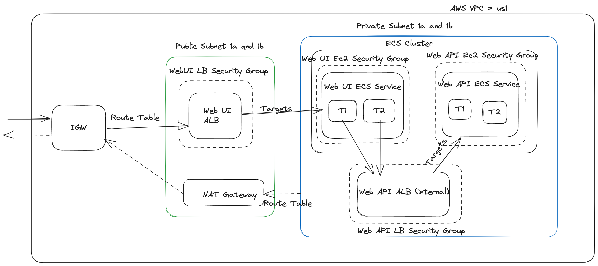

# How to Run

## AWS Setup
This project uses Pulimi to deploy the resorurces to AWS Cloud. For this POC we are working based on a few assumptions

 - Applications are deployed to AWS to run on ECS Fargate
 - After depoloyment application can be accessed by using the URL `http://<web-ui-url>` on http port. Where `web-ui-url` can be found from the Pulimi output.
 - Docker build and publish are part of the pulumi pipeline for now

Limitations and improvements:
 - Segreagete the app build process to a separate pipeline stage and pass image tag via config variables to Pulimi
 - Segregate ECS Fargate resources into seperate Pulimi project, allowing for independent application deployments
 - Setup route53 DNS and ACM certificate for the web-ui endpoint for more secure access via https



reference: https://excalidraw.com/#json=dnrE8rABHsCV20MJHKBg6,ZAIC1rHib4OhQsvaEWCllQ
## Local Setup

install docker on your machine: [Install Docker](https://docs.docker.com/engine/install/)


Open terminal and run:
```
docker-compose up
```

Open a web browser and navigate to 
```
http://localhost:3000
```

# Application Details

- Web: ASP.NET Core 5.0 Web APP
  - this application requires an environment variabled called "ApiAddress" which will be the address of the Web Api.
- API: ASP.NET Core 5.0 Web API

